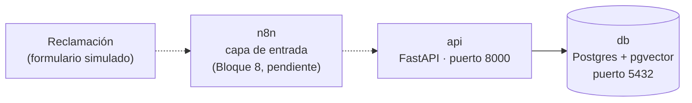

# Arquitectura de ClaimTrace

Estado a 8 oct 2026 (Bloque 3: datos de prueba). Los elementos punteados están
previstos y aún no se han construido.

## Servicios



| Servicio | Función | Puerto en tu máquina | Puerto interno |
|---|---|---|---|
| `db` | Postgres 16 con pgvector: vectores de políticas y registro de auditoría | 5433 (`POSTGRES_HOST_PORT`) | 5432 |
| `api` | Agente, RAG y LangGraph (Python). Por ahora solo `/health` | 8000 (`API_PORT`) | 8000 |
| `n8n` | Capa de entrada (Bloque 8, pendiente) | 5678 (`N8N_PORT`) | 5678 |

Los puertos se publican solo en `127.0.0.1`. Dentro de la red de Docker, `api`
llega a la base por el nombre del servicio (`db`) y el puerto interno (5432).

## Decisiones

- Base vectorial: pgvector, ver [ADR-001](decisions/001-vector-db.md).
- Formato de los datos de prueba y criterios de etiquetado, ver [ADR-002](decisions/002-test-data-format.md).

## Datos de prueba

> **Todos los datos de este proyecto son ficticios.** VERÉGIDA Seguros S.A., sus cláusulas, pólizas, reclamaciones y usuarios no corresponden a ninguna empresa ni persona real. Las cifras del caso son hipótesis de trabajo.

### Hipótesis del caso (ficticias)

- Unas 4.000 reclamaciones al mes.
- Unas 800 horas al mes de triage manual.
- Un 12 % de reclamaciones mal enrutadas.

### Formato

JSON, un archivo por entidad en `data/`. Los campos vacíos se escriben como `null`, de modo que los datos cargan directamente en Postgres en el Bloque 4.

| Archivo | Contenido | Cómo se genera |
|---|---|---|
| `clausulas.json` | 42 cláusulas de 6 documentos | Fijo (no lo genera el script) |
| `reclamaciones.json` | 33 reclamaciones etiquetadas | Fijo (no lo genera el script) |
| `polizas.json` | 24 pólizas | `scripts/generar_datos.py` |
| `usuarios.json` | 3 usuarios sintéticos, sin contraseñas | `scripts/generar_datos.py` |

`data/` contiene solo datos; el código que los genera y valida vive en `scripts/`.

### Convención de IDs

| Entidad | Formato | Ejemplo |
|---|---|---|
| Cláusula | `VRG-{CG\|POL}-{HOG\|AUTO\|DEV\|CAN\|FRA\|REC}-{n.m}` | `VRG-CG-HOG-6.1` |
| Póliza | `VRG-PLZ-{nnnn}` | `VRG-PLZ-0001` |
| Reclamación | `CLM-{nnnn}` | `CLM-0001` |
| Usuario | `USR-{nnn}` | `USR-001` |

Significado del ID de cláusula:

| Parte | Sigla | Significado |
|---|---|---|
| Tipo de documento | `CG` | Condiciones generales |
| | `POL` | Política interna |
| Materia | `HOG` | Seguro de hogar |
| | `AUTO` | Seguro de auto |
| | `DEV` | Devoluciones |
| | `CAN` | Cancelación |
| | `FRA` | Fraude |
| | `REC` | Reclamaciones formales |
| Número | `n.m` | Sección y apartado |

El ID de cláusula es el contrato con los bloques de RAG y de auditoría: no se cambia sin motivo.

### Corpus de cláusulas

| Documento | Ramo | Cláusulas |
|---|---|---|
| `cg_hogar` | hogar | 10 |
| `cg_auto` | auto | 9 |
| `pol_devoluciones` | comun | 8 |
| `pol_cancelacion` | comun | 5 |
| `pol_fraude` | comun | 5 |
| `pol_reclamaciones` | comun | 5 |

Campos de cada cláusula: `clause_id`, `documento`, `ramo`, `titulo`, `texto`.

**Reglas de enrutado que el corpus fija** (todas las cifras son ficticias):

| Destino | Cuándo | Cláusulas |
|---|---|---|
| `atencion_cliente` | Cobro indebido de hasta 150 €; impugnación de recibo en primera instancia; baja a petición del tomador | `VRG-POL-DEV-2.1`, `VRG-POL-DEV-4.1`, `VRG-POL-CAN-1.1` |
| `reclamaciones_formales` | Cobro indebido entre 150 € y 1.000 €; cliente no conforme con la respuesta o que reclama de nuevo; baja por impago que el cliente rebate | `VRG-POL-DEV-2.2`, `VRG-POL-DEV-4.2`, `VRG-POL-CAN-2.2`, `VRG-POL-REC-1.1` |
| `fraude` | Cobro por póliza no contratada; cambio de IBAN o de datos no autorizado; baja que el titular niega haber pedido | `VRG-POL-FRA-3.1`, `VRG-POL-FRA-3.2`, más `VRG-POL-FRA-2.1` |
| `compliance_revision` | Cobro indebido de más de 1.000 €; amenaza de acciones legales o queja ante el supervisor; baja con siniestro abierto | `VRG-POL-DEV-2.3`, `VRG-POL-REC-2.2`, `VRG-POL-CAN-3.1` |

**Criterios para etiquetar las cláusulas esperadas** (se citan las que justifican el destino y ninguna más):

- **Fraude:** la cláusula específica (`FRA-3.1` si la póliza no es del cliente, `FRA-3.2` si niega un cambio o una baja) más `FRA-2.1`, que manda el caso al equipo de fraude. `FRA-1.1` es la definición general y no se cita.
- **Cobros posteriores a la baja:** `DEV-3.2` en los casos de tipo `cobro_indebido` y `CAN-2.1` en los de tipo `cancelacion_poliza`.
- **Un solo disparador por caso:** si un texto activa dos reglas con destinos distintos, el corpus no dice cuál prevalece. Por eso cada texto activa solo una (por ejemplo, la amenaza al supervisor en `CLM-0019`).

**Temas que el corpus deja fuera a propósito** (para los casos de `sin_clausula_relevante`):

- Recargos por pago fraccionado.
- Venta del vehículo y devolución proporcional de la prima.

El robo en la vivienda también queda fuera del alcance del proyecto.

### Pólizas (`polizas.json`)

| Campo | Ejemplo | Notas |
|---|---|---|
| `policy_id` | `VRG-PLZ-0001` | |
| `ramo` | `hogar` / `auto` | |
| `estado` | `activa` / `cancelada` | |
| `prima_mensual` | `42.50` | Prima base mensual, sin descuento por alarma. Fija en las pólizas con recibos en reclamaciones; con semilla en las demás |
| `fecha_alta` | `2024-03-01` | |
| `alarma_asociada` | `true` / `false` / `null` | Solo en Hogar; `null` en Auto |

**Reparto fijo de las 24 pólizas** (la fecha de alta sale de un generador con semilla fija; la prima, solo en las pólizas sin prima fija):

| Pólizas | Ramo | `alarma_asociada` |
|---|---|---|
| `0001` a `0012` | hogar | `true` en las impares y `false` en las pares (6 y 6) |
| `0013` a `0024` | auto | `null` |

Pólizas con `estado: cancelada`: `VRG-PLZ-0008` (Hogar), `VRG-PLZ-0016` y `VRG-PLZ-0022` (Auto). El resto están `activa`. Una póliza cancelada solo aparece en reclamaciones que citan `VRG-POL-DEV-3.2`, `VRG-POL-CAN-2.1` o `VRG-POL-CAN-3.2`.

El día de cargo del recibo es el 5 en Hogar y el 10 en Auto.

### Reclamaciones (`reclamaciones.json`)

| Campo | Ejemplo | Para qué sirve |
|---|---|---|
| `claim_id` | `CLM-0001` | Identificador |
| `tipo` | `cobro_indebido` / `disputa_recibo` / `cancelacion_poliza` / `otro` | `otro` solo en el caso de tipo no reconocible |
| `texto` | Mensaje del cliente | Lo que lee el agente |
| `policy_id`, `importe`, `fecha` | o `null` | Datos de la regla de abstención. `policy_id` es `null` solo en `CLM-0010` y `CLM-0029` (`campo_ausente`) y en `CLM-0033` (`tipo_no_reconocible`) |
| `destino_esperado` | `atencion_cliente`, `reclamaciones_formales`, `fraude`, `compliance_revision` | Etiqueta para medir el enrutamiento. `null` si hay abstención |
| `esperado_abstencion` | `true` / `false` | Si el agente debe parar y escalar |
| `motivo_abstencion` | `campo_ausente` / `sin_clausula_relevante` / `tipo_no_reconocible` / `null` | Criterio verificable |
| `campos_faltantes` | `["importe"]` | Solo con `campo_ausente`; si no, `[]` |
| `clausulas_esperadas` | `["VRG-POL-DEV-2.1"]` | Etiqueta para medir las citas. `[]` si hay abstención |

El `ramo` de la reclamación no se guarda: se deduce de la póliza.

**Campos requeridos por tipo** (los que, si faltan, obligan a abstenerse):

| Tipo | Campos requeridos | Qué es `fecha` |
|---|---|---|
| `cobro_indebido` | `policy_id`, `importe`, `fecha` | Fecha del cargo |
| `disputa_recibo` | `policy_id`, `importe`, `fecha` | Fecha del recibo |
| `cancelacion_poliza` | `policy_id`, `fecha` | La fecha que da el cliente: la de la solicitud, la del aviso recibido o la de la baja pedida. `importe` es opcional |

**Regla de la fecha del recibo:** si el texto solo da el mes ("el recibo de agosto"), el día se completa con el día de cargo del ramo (5 en Hogar, 10 en Auto). Si el texto no da ni el mes ("el último recibo"), la `fecha` falta y el caso es de abstención por `campo_ausente`.

**Coherencia de los datos:** una póliza nunca tiene dos recibos del mismo mes con importes distintos. Las 24 pólizas aparecen en alguna reclamación y, cuando una aparece en dos, los relatos son compatibles (`VRG-PLZ-0022`, la póliza cancelada de Auto, solo la usa `CLM-0024`).

**Reparto de los 33 casos:**

| Grupo | Casos | Notas |
|---|---|---|
| Cobro indebido | `CLM-0001` a `0010` | 8 completos y 2 incompletos |
| Disputa de recibo | `CLM-0011` a `0020` | 8 completos y 2 incompletos |
| Cancelación de póliza | `CLM-0021` a `0030` | 8 completos y 2 incompletos |
| Sin cláusula relevante | `CLM-0031`, `CLM-0032` | Recargo por pago fraccionado; venta del vehículo |
| Tipo no reconocible | `CLM-0033` | Tipo `otro` |

Destinos de los 24 casos completos: 12 `atencion_cliente`, 5 `reclamaciones_formales`, 4 `fraude` y 3 `compliance_revision`. Hay 9 casos con abstención esperada (6 `campo_ausente`, 2 `sin_clausula_relevante`, 1 `tipo_no_reconocible`).

### Casos con alarma (cruce póliza + cláusula)

La cláusula `VRG-CG-HOG-6.1` concede un 8 % de descuento si la póliza tiene alarma conectada registrada. Las reclamaciones `CLM-0011`, `CLM-0012` y `CLM-0016` son de pólizas con alarma (el descuento debe aplicarse) y `CLM-0013` es de una póliza sin alarma (no aplica). Una póliza de Auto nunca debe recibir esa cláusula, lo que también prueba el filtro por `ramo`.

### Generador y validación (`scripts/generar_datos.py`)

```powershell
python scripts/generar_datos.py
```

Genera `polizas.json` y `usuarios.json` con la semilla 2026 (misma semilla, mismos datos) y, **antes de guardar**, valida la coherencia de los cuatro archivos con 12 comprobaciones: importe de `CLM-0004` (12 veces la prima de su póliza), fecha de la reclamación no anterior al alta (el mismo día cuenta como cubierto), `policy_id` y cláusulas existentes, destino y abstención coherentes, totales (33 casos y 9 abstenciones), combinación de cláusulas de fraude, pólizas canceladas, ramo de las cláusulas, recibos duplicados, campos requeridos e importe y mes presentes en el texto. Si alguna falla, muestra todos los errores, no guarda nada y termina con código 1.

### Usuarios sintéticos (`usuarios.json`)

| Campo | Ejemplo | Notas |
|---|---|---|
| `usuario_id` | `USR-001` | |
| `username` | `analista1` | |
| `rol` | `analista` / `supervisor` | 2 analistas y 1 supervisor; sin rol de administrador |

Sin contraseñas ni hashes en `data/`. Las credenciales de prueba se generan al sembrar la base, desde variables de entorno.